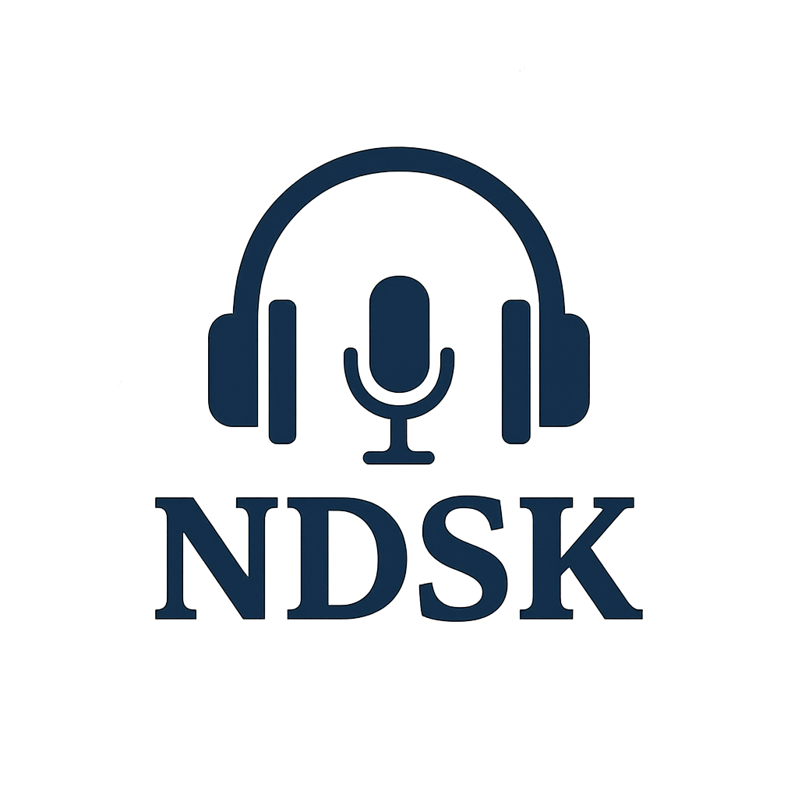

# nassdubstudio.github.io
<html lang="en">
<head>
  <meta charset="UTF-8" />
  <meta name="viewport" content="width=device-width, initial-scale=1.0"/>
  Nass Dub Studio Kaduna
  <link href="style.css" rel="stylesheet"/>
</head>
<body>
  <header>
    
    <h1>Nass Dub Studio Kaduna</h1>
    
Your Premier Audio and Video Dubbing Studio in Kaduna

  </header>

  <nav style="text-align: center; padding: 1rem;">
    <a href="index.html">Home</a> |
    <a href="blog.html">Blog</a>
  </nav>

  <section id="about">
    <h2>About Us</h2>
    
Welcome to Nass Dub Studio Kaduna — a professional dubbing and audio production studio dedicated to high-quality sound for films, music, and voiceovers. Located in the heart of Kaduna, we offer modern facilities for crystal-clear recordings.

  </section>

  <section id="services">
    <h2>Our Services</h2>
    <ul>
      <li>🎤 Audio Dubbing</li>
      <li>🎶 Music Production</li>
      <li>🎧 Voiceover Services</li>
      <li>🎬 Video Editing</li>
    </ul>
  </section>

  <section id="contact">
    <h2>Contact Us</h2>
    
📧 Email: <a href="mailto:Nassdubstudiokaduna@gmail.com">Nassdubstudiokaduna@gmail.com</a>

    
📞 Phone: <a href="tel:+2348146125623">08146125623</a>

    
📍 Address: Shop 128, Kawo Motor Park, Kaduna

  </section>
  <a href="https://wa.me/2348146125623" class="whatsapp-float" target="_blank">
    💬 Chat with us on WhatsApp
  </a>
  <footer>
    
&copy; 2025 Nass Dub Studio Kaduna. All rights reserved.

  </footer><!DOCTYPE html>
<html lang="en">
<head>
  <meta charset="UTF-8" />
  <meta name="viewport" content="width=device-width, initial-scale=1.0"/>
  <title>Media Gallery | Nass Dub Studio Kaduna</title>
  
</head>
<body>

  <header>
    <h1>🎬 Nass Dub Studio Media Gallery</h1>
    
Photos, Videos, and Music from Our text-al
text-ader>

  <section>
    <h2>📸 Picture</h2>
    

      
Studio Session

      
    

  </section>

  <footer>
    
&copy; 2025 Nass Dub Studio Kaduna

  </footer>

</body>
</html>
</body>
</html>
